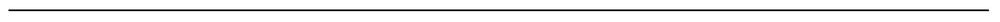
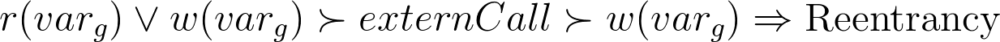
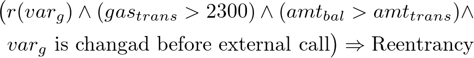

# Doublade

In, our experiment studies, we conduct...

### Evaluating the Existing Tools

##### Table 1: The number of detected vulnerabilities at contract level and true positive (TP) rate of each scanner.

| Vulnerability (TP Rate)  | Slither      | Oyente       | Smartcheck   | Securify |
| ------------------------ | ------------ | ------------ | ------------ | -------- |
| Reentrancy               | 498 (9.24%)  | 108 (50.93%) | x            |          |
| Abuse of tx.origin       | 34 (100.0%)  | x            | 210 (29.05%) | x        |
| Unchecked low level call | x            | x            | 551 (65.70%) | x        |
| Unexpected revert        | 666 (35.29%) | x            | 274 (93.79%) | x        |
| Self destruct            | 46 (23.91%)  | x            | x            | x        |

As shown in Table 1, we apply the three scanners on the six types of vulnerabilities. Overall, among these three scanners, **Slither** seems to achieve the best results, reporting most vulnerabilities---totally 2631 vulnerability candidates of five types. In contrast, **Smartcheck** reports 1072 candidates and **Oyente** reports only 588 candidates.  However, due to the  internal detection mechanisms, each scanner inevitably yields some FPs.

 After manual inspection of human expertise, the TP rate is shown at the second row of each cell in Table 1. In generally, **Slither** reports the most candidates, but suffers from a big issue of a high FP rate. Especially for reentrancy, the TP rate of **Slither** is only about 9%. As dynamic analysis is more accurate, **Oyente**'s TP is still acceptable. To some extent, it is unexpected that the TP rate of **Smartcheck** is good. We review some FPs of these scanners as below.

As the reentrancy caused some significant losses in the past [daoAttack](https://doi.org/10.1109/ICSAI.2017.8248566), the real contracts on Ethereum have already adopted some DMs to prevent from the actual invocation of reentrancy.  We summarize the five main categories of DMs: 

* Hard-coding the constant value for the address of payee or payer
* Using `private` modifier for the function declaration
* Adding the self-predefined modifier in the function declaration 
* Using `if` lock(s) to prevent reentrancy. However, these DMs are seldom discussed in relevant studies or considered in existing scanners. Hence, the ignorance about possible DMs will result in the high FP rate of detection

For the first DM, in [CB1](https://github.com/ToolmanInside/SolVulnerabilities/blob/master/code%20blocks/CB1.sol), according to rule of **Slither**:

[CB1](https://github.com/ToolmanInside/SolVulnerabilities/blob/master/code%20blocks/CB1.sol) is reported as a reentrancy  by **Slither**---firstly, it writes to the public variable `total_reward`; then calls external function `buyTokens.value`; last, writes to the public variable `winnerPoolTotal`. However, in reality, reentrancy will never be triggered by external attackers due to the hard-coded address value at line 13 in [CB1](https://github.com/ToolmanInside/SolVulnerabilities/blob/master/code%20blocks/CB1.sol). Similarly, in [CB2](https://github.com/ToolmanInside/SolVulnerabilities/blob/master/code%20blocks/CB2.sol), we show a FP for **Oyente**, according to its run-time detection rule below:

where r(varg) means read operation(s) to a public variable, gas(trans) > 2300 means the gas for transaction must be larger than 2300, amt(bal) > amt(trans) means the balance amount must be larger than transfer amount, and lastly the global variable could be changed before external calls.

Although [CB2](https://github.com/ToolmanInside/SolVulnerabilities/blob/master/code%20blocks/CB2.sol) satisfies all the four conditions, it actually could not be triggered by external attackers, again due to the only hard-coded address allowed in the transaction.

For the second DM of using private modifier, the existing scanners fail to consider that. In our manual inspection  of FPs, we consider the following defense is successful: if this private function (reported by **Slither** or **Oyente** as reentrancy) is never called by other public  functions in the same contract, or only called by the public functions that have no loop path in  their CFGs. Under such scenario, the reported function will actually never be recursively called by external attackers. For example, if we changed the modifier of  function `buyOne` from `public` to `private` at line 1 in [CBoriginal](https://github.com/ToolmanInside/SolVulnerabilities/blob/master/code%20blocks/CBoriginal.sol), **Slither** would still report it as a reentrancy vulnerability---but it could never be called by external attackers, as it is not called in other functions. We find that **Oyente** also suffers from this FP issue.

For the third DM of adopting user-defined modifier for protection, we find some interesting cases that are falsely reported by existing scanners. For example, [CB3](https://github.com/ToolmanInside/SolVulnerabilities/blob/master/code%20blocks/CB3.sol) actually takes into account the security issue and adds the self-defined modifier `onlyAdmin()` before the possibly vulnerable function `regstDocs`. Since `onlyAdmin()` restricts that the transaction can be only done by the `admin` or `owner` role, otherwise the transactions will be reverted. In such a way, `regstDocs` could not be recursively called by external attackers.

Different from the above three DMs on permission control to prevent external malicious calls, the last DM is to prevent the recursive entrance for the function---eliminating the issue from root. For instance, in [CB4](https://github.com/ToolmanInside/SolVulnerabilities/blob/master/code%20blocks/CB4.sol), the internal instance variable `reEntered` will be checked at line 5 before processing the business logic between line 8 and 10. To prevent the reentering due to calling `ZTHTKN.buyAndSetDivPercentage.value`, `reEntered` will switched to `true`; after the transaction is done, it will be reverted to `false` to allow other transactions.

Totally, 457 FP cases are manually identified for **Slither**. Among them, 216 FPs are attributed for the first DM,  76 FPs for the second,  47 FPs for the third, and only 1 FP for the forth DM and 117 for other causes. In contrast, **Oyente** has fewer FP cases (only 53 in total), among which the distribution for the four caused DMs is 5, 5, 22 and 0. 